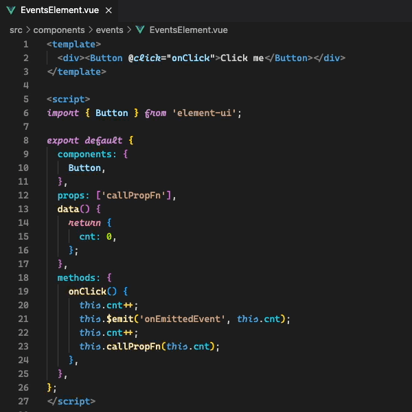
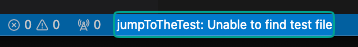

# Jump to the Test

## About the Extension
This extension registers a command that allows you to switch between the code and its respective test file. It does this based on the name of the current file and looks for a file that matches the pattern of its name.

## Features

On MacOS, press `Ctrl+Option+T`.

On Windows / Linux, press `Ctrl+Alt+T`.

When the command is executed, your editor will jump to your test file..

If you cannot find your respective test file, then there will be an error message in the status bar.

The extension should successfully take you between files named in the following patterns (including Vue files), regardless of the extensions:

Vue file:

<ul>
  <li>component.vue --> component.spec.js</li>
  <li>component.spec.js --> component.vue</li>
</ul>
<ul>
  <li>component.vue --> component.spec.ts</li>
  <li>component.spec.ts --> component.vue</li>
</ul>

Javacript file:

<ul>
  <li>FileName.js --> FileName.spec.js</li>
  <li>FileName.spec.js --> FileName.js</li>
</ul>
<ul>
  <li>FileName.js --> FileName.test.js</li>
  <li>FileName.test.js --> FileName.js</li>
</ul>

Typescript file:

<ul>
  <li>FileName.service.ts --> FileName.service.test.js</li>
  <li>FileName.service.test.js --> FileName.service.ts</li>
</ul>
<ul>
  <li>FileName.service.ts --> FileName.service.spec.js</li>
  <li>FileName.service.spec.js --> FileName.service.ts</li>
</ul>

Ruby file:

<ul>
  <li>file_name.rb --> file_name_test.rb</li>
  <li>file_name_test.rb --> file_name.rb</li>
</ul>
<ul>
  <li>file_name.rb --> file_name_spec.rb</li>
  <li>file_name_spec.rb --> file_name.rb</li>
</ul>

Java file:

<ul>
  <li>FileName.java --> FileNameTest.java</li>
  <li>FileNameTest.java --> FileName.java</li>
</ul>
<ul>
  <li>FileName.java --> FileNameSpec.java</li>
  <li>FileNameSpec.java --> FileName.java</li>
</ul>

Rust file:

<ul>
  <li>file-name.rs --> file-name-test.rs</li>
  <li>file-name-test.rs --> file-name.rs</li>
</ul>
<ul>
  <li>file-name.rs --> file-name-spec.rs</li>
  <li>file-name-spec.rs --> file-name.rs</li>
</ul>

## Release Notes

All releases are experimental and will improve with your suggestions.

**Enjoy!**
